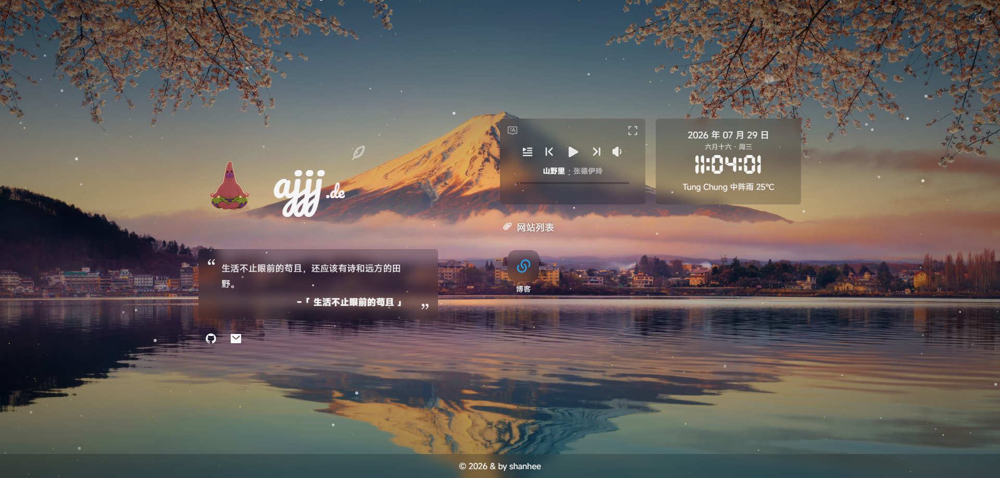

简体中文 | [English](./docs/README_EN.md)

# 無名の主页

一个基于 React 和 Cloudflare 构建的个人导航主页，包含站点导航、天气、一言、音乐播放器、壁纸和管理员后台。



[在线预览](https://ajjj.de/)

## 主要功能

- 响应式主页、站点与社交链接管理
- 时间、天气、一言和时光进度展示
- 音乐搜索、歌单播放、歌词和媒体快捷键
- Bing、Wallhaven 与 R2 自定义壁纸，支持定时切换
- 管理员后台、设备管理和操作审计
- PWA 离线启动与管理员离线草稿同步

## 技术栈

- React、TypeScript、Vite、Zustand
- Cloudflare Pages Functions、D1、R2
- IndexedDB、Workbox PWA
- IconPark、Iconify

## 部署到 Cloudflare

部署前需要一个 GitHub 账号和一个已开通 Pages、D1、R2 的 Cloudflare 账号。当前只支持 Cloudflare Pages。

### 1. 准备仓库和 Cloudflare 资源

1. Fork 本仓库到自己的 GitHub 账号。
2. 在 Cloudflare 控制台创建一个名为 `home` 的 D1 数据库。
3. 创建一个名为 `home-assets` 的 R2 Bucket。

### 2. 创建 Pages 项目

在 Cloudflare 控制台进入 Workers & Pages，选择“创建应用”并连接刚才 Fork 的 GitHub 仓库：

| 项目 | 填写内容 |
| --- | --- |
| 生产分支 | `main` |
| 构建命令 | `pnpm build` |
| 构建输出目录 | `dist` |
| 根目录 | 留空 |

### 3. 添加资源绑定和密钥

在 Pages 项目的“设置”中添加以下绑定：

| 类型 | 变量名称 | 绑定内容 |
| --- | --- | --- |
| D1 数据库 | `DB` | 选择创建的 D1 数据库 |
| R2 Bucket | `ASSET_BUCKET` | 选择创建的 R2 Bucket |
| Secret | `OWNER_PASSWORD` | 管理员登录密码，至少 8 个字符 |
| Secret | `IP_HASH_SECRET` | 至少 32 个字符的随机字符串 |
| Secret | `CHKSZ_API_KEY` | ChKSz 网易云音乐解析 API 密钥 |

`OWNER_PASSWORD`、`IP_HASH_SECRET` 和 `CHKSZ_API_KEY` 必须选择 Secret 类型，不要添加 `VITE_` 前缀。`CHKSZ_API_KEY` 可在 [ChKSz API](https://api.chksz.com/) 登录后获取；可按需添加 `QWEATHER_API_KEY` 和 `WALLHAVEN_API_KEY`。

### 4. 首次初始化

在电脑上安装 Node.js 24+ 和 pnpm 11+，然后进入仓库目录执行：

```bash
pnpm install --frozen-lockfile
pnpm exec wrangler login
pnpm db:migrate:remote
pnpm db:seed:generate
pnpm db:seed:remote
```

这组初始化命令只需在全新数据库上执行一次。完成后刷新站点，即可使用 `OWNER_PASSWORD` 登录管理员后台并修改站点资料。

不要将真实密码、密钥、`.dev.vars` 或 `.site-content.seed.json` 提交到仓库。

## 本地维护

```bash
pnpm install --frozen-lockfile
cp .dev.vars.example .dev.vars
pnpm db:migrate:local
pnpm db:seed:generate
pnpm db:seed:local
pnpm dev:cf
```

编辑 `.dev.vars`，填写本地使用的 `OWNER_PASSWORD` 和 `IP_HASH_SECRET`，然后访问 `http://localhost:3000`。只调整前端页面时可使用 `pnpm dev:web`。

`wrangler.local.jsonc` 仅用于本地 D1 和 R2，不参与 Cloudflare Pages 生产部署。

站点初始内容来自 `scripts/site-content.seed.example.json`。部署完成后，站点资料、默认行为、音乐、壁纸和一言均可在管理员后台维护；代码仓库地址用于“关于”页面检查更新。

## 数据与离线行为

- D1 保存站点配置、设备、会话和审计记录。
- R2 保存经过服务端格式检测的自定义壁纸和网站图标；壁纸单文件最大 50MB，网站图标最大 512KB，SVG 图标还会过滤脚本和外部资源引用。
- 管理员选中的网站 favicon 会按内容哈希去重存入 R2，公开页面不再实时依赖目标网站或第三方 favicon 服务。
- IndexedDB 保存管理员草稿和待同步操作，恢复网络后自动提交。
- PWA 缓存应用外壳、最近配置，以及有限数量的壁纸和网站图标；未缓存的音乐资源不保证离线播放。

## 外部服务

- [nuoxian's API 音乐解析](https://docs.nxvav.cn/doc/music.html)
- [ChKSz API 网易云音乐解析](https://api.chksz.com/docs/163_music.html)
- [nuoxian's API 必应每日美图](https://docs.nxvav.cn/doc/bing.html)
- [Wallhaven API](https://wallhaven.cc/help/api)
- [Open-Meteo](https://open-meteo.com/) 与 [MET Norway](https://api.met.no/)
- [Hitokoto 一言](https://hitokoto.cn/)

## 致谢

感谢原作者 imsyy 和所有参与维护、反馈与测试的贡献者。

- [imsyy](https://github.com/imsyy/)
- [NanoRocky](https://github.com/NanoRocky/home)
